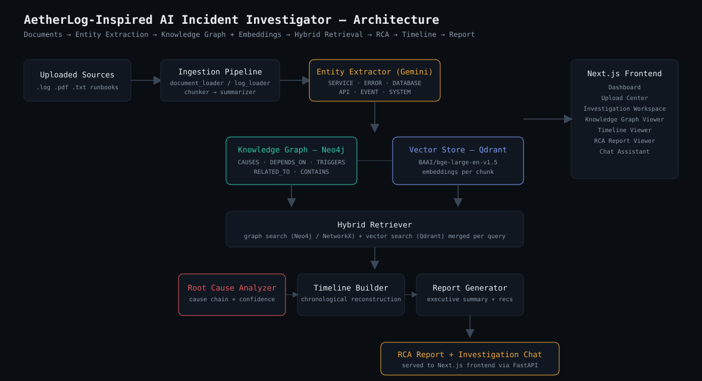

# AetherLog-Inspired AI Incident Investigator

An AI-powered **Root Cause Analysis (RCA) and Incident Investigation Platform** —
not a chatbot. Upload logs, PDFs, incident reports, runbooks, and architecture
documents; the system builds a knowledge graph, runs hybrid (vector + graph)
retrieval, reasons over the evidence with an LLM, reconstructs a timeline, and
produces an executive-ready RCA report — plus a grounded chat interface for
follow-up investigation.



## Core workflow

```
Documents/Logs
   → Chunking
   → Entity & Relationship Extraction (Gemini + heuristic fallback)
   → Knowledge Graph (Neo4j / NetworkX)
   → Embeddings (BAAI/bge-large-en-v1.5) → Vector Store (Qdrant)
   → Hybrid Retrieval (graph + vector)
   → Root Cause Analysis (cause chain + confidence + evidence)
   → Timeline Reconstruction
   → RCA Report Generation
   → Conversational Investigation Chat
```

## Tech stack

| Layer            | Technology                                  |
|-------------------|---------------------------------------------|
| Backend            | FastAPI, async, repository + service layers |
| Frontend           | Next.js 15, TypeScript, Tailwind CSS        |
| LLM                | Gemini 2.5 Flash (`google-genai` SDK)        |
| Embeddings         | BAAI/bge-large-en-v1.5 (sentence-transformers) |
| Vector database    | Qdrant                                       |
| Knowledge graph    | Neo4j + NetworkX                             |
| Document parsing   | PyMuPDF                                      |
| Containerization   | Docker, Docker Compose                       |

## Project structure

```
ai-investigator/
├── docker-compose.yml
├── .env.example
├── docs/
│   └── architecture.svg
├── backend/
│   ├── Dockerfile
│   ├── requirements.txt
│   ├── pytest.ini
│   ├── .env.example
│   └── app/
│       ├── main.py                    # FastAPI entrypoint
│       ├── core/
│       │   ├── config.py              # Settings (env-driven)
│       │   ├── logging_config.py
│       │   └── dependencies.py        # DI wiring for all services
│       ├── models/
│       │   └── schemas.py             # All Pydantic DTOs
│       ├── api/
│       │   ├── upload.py              # POST /upload
│       │   ├── investigate.py         # POST /investigate, GET /timeline, GET /report
│       │   ├── chat.py                # POST /chat
│       │   └── graph.py               # GET /graph/{id}
│       ├── repositories/
│       │   └── incident_repository.py # In-memory repository pattern
│       ├── services/
│       │   ├── ingestion/
│       │   │   ├── document_loader.py
│       │   │   ├── log_loader.py
│       │   │   ├── chunker.py
│       │   │   ├── summarizer.py
│       │   │   └── entity_extractor.py
│       │   ├── graph/
│       │   │   ├── graph_builder.py
│       │   │   ├── graph_retriever.py
│       │   │   └── neo4j_service.py
│       │   ├── vector/
│       │   │   ├── embedder.py
│       │   │   ├── qdrant_service.py
│       │   │   └── vector_retriever.py
│       │   ├── retrieval/
│       │   │   └── hybrid_retriever.py
│       │   ├── reasoning/
│       │   │   ├── root_cause_analyzer.py
│       │   │   ├── timeline_builder.py
│       │   │   ├── evidence_builder.py
│       │   │   └── report_generator.py
│       │   ├── agents/
│       │   │   └── investigation_agent.py
│       │   └── llm/
│       │       └── gemini_client.py
│       └── tests/
│           ├── test_chunker.py
│           ├── test_entity_extractor.py
│           └── test_root_cause_analyzer.py
└── frontend/
    ├── Dockerfile
    ├── package.json
    ├── tailwind.config.ts
    ├── app/
    │   ├── layout.tsx
    │   ├── page.tsx                   # Dashboard
    │   ├── upload/page.tsx            # Upload Center
    │   ├── investigate/[id]/page.tsx  # Investigation Workspace
    │   ├── graph/[id]/page.tsx        # Knowledge Graph Viewer
    │   ├── timeline/[id]/page.tsx     # Timeline Viewer
    │   ├── report/[id]/page.tsx       # RCA Report Viewer
    │   └── chat/[id]/page.tsx         # Chat Assistant
    ├── components/
    │   ├── Sidebar.tsx
    │   └── ui.tsx
    └── lib/
        ├── api.ts
        └── useInvestigationId.ts
```

## Design notes

- **Clean architecture**: API routes are thin; all logic lives in `services/`,
  state access goes through the `repositories/` layer, and everything is
  wired together in `core/dependencies.py`. Swapping in-memory storage for
  Postgres, or Gemini for another LLM, touches one file, not the whole app.
- **Graceful degradation**: every external dependency (Gemini, Neo4j, Qdrant)
  has a fallback path — heuristic entity extraction, an in-process NetworkX
  graph, and an in-memory vector store — so the full pipeline runs end-to-end
  even without API keys or infra running, which matters for live demos.
- **Repository pattern** for investigation/document/chunk state
  (`incident_repository.py`), **service layer pattern** for all business
  logic, and a small **dependency-injection container** for wiring.
- **Async FastAPI**, typed Pydantic schemas shared across the whole backend,
  structured logging via loguru, and retry/backoff around LLM calls.

## Getting started

### Option A — Docker Compose (recommended)

```bash
cp .env.example .env
# edit .env and add your GEMINI_API_KEY (optional — the app runs in
# heuristic/offline mode without it)

docker compose up --build
```

- Frontend: http://localhost:3000
- Backend docs (Swagger): http://localhost:8000/docs
- Neo4j Browser: http://localhost:7474
- Qdrant dashboard: http://localhost:6333/dashboard

### Option B — Run locally

**Backend**

```bash
cd backend
python -m venv .venv && source .venv/bin/activate
pip install -r requirements.txt
cp .env.example .env   # add GEMINI_API_KEY, and point at local/remote Neo4j+Qdrant
uvicorn app.main:app --reload
```

**Frontend**

```bash
cd frontend
npm install
cp .env.local.example .env.local
npm run dev
```

**Neo4j & Qdrant** (if not using Docker Compose)

```bash
docker run -p 7474:7474 -p 7687:7687 -e NEO4J_AUTH=neo4j/change_me_password neo4j:5.24-community
docker run -p 6333:6333 qdrant/qdrant:v1.11.2
```

### Running backend tests

```bash
cd backend
pytest
```

## API reference

| Method | Path                       | Description                                      |
|--------|-----------------------------|---------------------------------------------------|
| POST   | `/api/upload`               | Ingest one or more documents into an investigation |
| POST   | `/api/investigate`          | Run hybrid retrieval + RCA + timeline + report     |
| POST   | `/api/chat`                 | Ask a grounded follow-up question                  |
| GET    | `/api/graph/{id}`           | Fetch the knowledge graph (nodes + edges)          |
| GET    | `/api/timeline/{id}`        | Fetch the reconstructed timeline                   |
| GET    | `/api/report/{id}`          | Fetch the generated RCA report                     |
| GET    | `/api/investigations`       | List all investigations                            |
| GET    | `/health`                   | Health check                                       |

## Example: entity/relationship extraction prompt

The extractor sends chunks to Gemini with a strict-JSON system prompt
(`app/services/ingestion/entity_extractor.py`):

```
Entity types: SERVICE, ERROR, COMPONENT, DATABASE, API, EVENT, SYSTEM.
Relationship types: CAUSES, DEPENDS_ON, RELATED_TO, CONTAINS, TRIGGERS.
{
  "entities": [{"name": "Redis", "type": "DATABASE"}],
  "relationships": [{"source": "Redis", "target": "Timeout", "type": "CAUSES", "confidence": 0.9}]
}
```

If `GEMINI_API_KEY` is unset, a regex/keyword heuristic extractor takes over
so the whole pipeline — ingestion through report generation — still works
offline, which is useful for demos without live API access.

## Notes on production hardening

This is a hackathon-grade reference implementation. Before shipping to
production, consider: a real database-backed repository instead of the
in-memory store, background job processing for ingestion/investigation
(Celery/RQ) instead of synchronous request handling, authentication on the
API, rate limiting, and swapping the process-local NetworkX graph for
Neo4j-only reads once the graph grows large.
